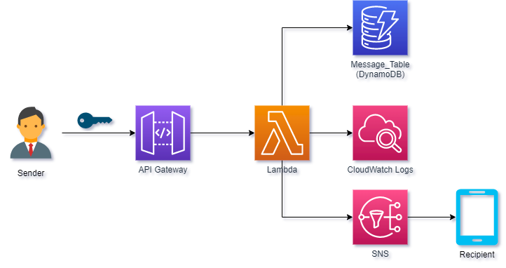

# SMS Delivery

Sends SMS to a provided phone number

Built using Serverless, NodeJS, AWS (API Gateway, Lambda, DynamoDB and SNS)

## Architecture



## Pre-requisite
- DynamoDB Table (e.g Messages_Table with primary key (`pk`) and sort key (`sk`))

## Setup
```bash
$ cd SMS-Delivery-Service
$ mv env.example.yml env.yml
- Provide needed details in env.yml
$ npm install
$ serverless deploy -s test --verbose
```

## Test
Send message to a specific phone number
```bash
$ curl --location --request POST \
    'https://ngld7p12d3.execute-api.ap-southeast-1.amazonaws.com/test/api/message' \
    --header 'x-api-key: <API Key>' \
    --header 'Content-Type: application/json' \
    --data-raw '{
        "recipient": "+1234567890",
        "message": "Hello!"
    }'
```
Retrieve the messages by phone number
```bash
$ curl --location --request GET \
    'https://ngld7p12d3.execute-api.ap-southeast-1.amazonaws.com/test/api/messages?recipient=%2B1234567890' \
    --header 'x-api-key: <API Key>'

Sample response:
{
    "recipient": "+1234567890",
    "messages": [
        {
            "message": "Hello!",
            "date": "2022-07-01T08:53:25.958Z"
        },
        {
            "message": "Hi!",
            "date": "2022-07-01T09:28:57.578Z"
        }
    ]
}
```
